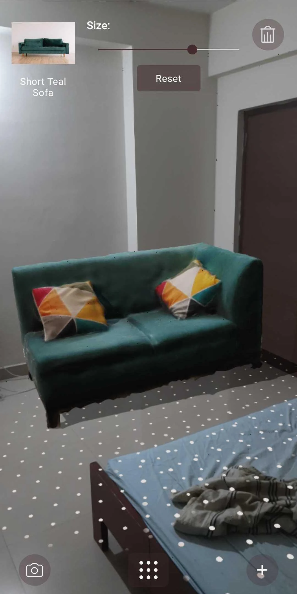

<h1 align="center">
  
   
  Glimpse-Android
   
</h1>
<h4 align="center">Show your products using Augmented Reality</h4>

<!--# Glimpse-Android-->
<!---->

## About
> You can read the [medium post](https://shashank7-iitd.medium.com/visualizing-stuff-using-augmented-reality-7a4979c71083) to get started

This repository contains working code for [Glimpse](https://play.google.com/store/apps/details?id=com.glimpse.app). You can find the app on [Google Playstore](https://play.google.com/store/apps/details?id=com.glimpse.app) and take it for a test drive. The app can be used to have a look at 3D models of furniture or other home appliances.
It's a fully functional app with following features:
1. Complete phone based authentication workflow based on Firebase authentication
2. [Sceneform](https://github.com/google-ar/sceneform-android-sdk) for showing 3D models in augmented reality
3. Ability to change size of 3d models
4. Adding or removing multiple models
5. Scalability: Adding 3d models from database in realtime
6. Firebase backend integration for realtime DB
7. Crashalytics support

  
  

## How to Use
**Note: The app won't work on the emulator because of phone based sign in**

1. Open the project in Android Studio and Build
2. By Default it'll use our own firebase DB for login
3. Login and select a store
4. Select a product
5. Now move you phone side to side with camera facing a plane
6. Tap on the plane to place the product

## How to make Changes
1. Replacing the Database:
   1. With Firebase: replace `app/google-services.json` with the one generated with your own firebase project
   2. With Some other DB: You'll need to make changes wherever Firebase client is being called, for example getting the stores, getting products within a store etc
2. Using my own models: integrate your own database and upload your models there

## License
[MIT](https://opensource.org/licenses/MIT)

